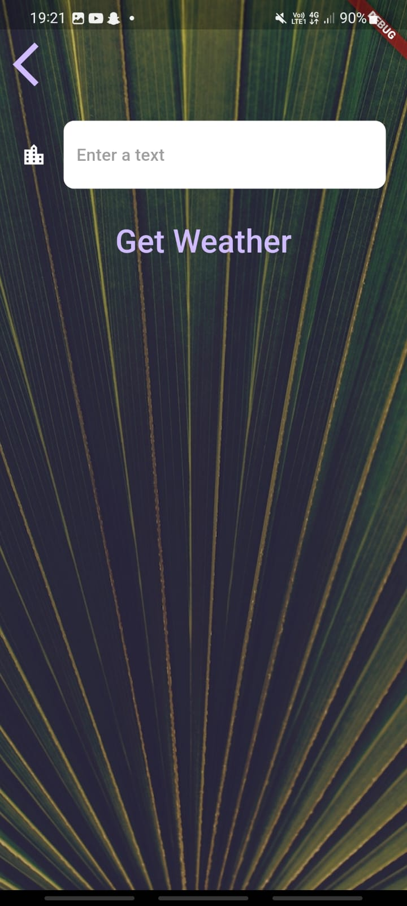

# Weather App

## Overview
The **Weather App** is a Flutter application that provides real-time weather updates based on the user's location or a searched city. It integrates **OpenWeather API** to fetch weather data and displays temperature, weather conditions, and relevant messages in an interactive UI.

## Application Screenshot
Below is an image of the Weather App interface:




## Features
- **Fetch Weather Data by Location** (GPS-based)
- **Search Weather by City Name**
- **Real-Time API Integration** (OpenWeather API)
- **Custom Weather Icons & Messages**
- **Interactive UI with Animated Loaders**

## Technologies Used
- **Flutter (Dart)** for UI Development
- **Geolocator** for GPS-based location fetching
- **HTTP Package** for API requests
- **Lottie Animations** for smooth UI effects

## File Structure
```
WeatherApp/
│── lib/
│   ├── main.dart               # Main entry point
│   ├── screens/
│   │   ├── loading_screen.dart  # Splash screen & API call initiation
│   │   ├── location_screen.dart # Main weather display UI
│   │   ├── city_screen.dart     # Search weather by city
│   ├── services/
│   │   ├── weather.dart         # API calls & data processing
│   │   ├── networking.dart      # HTTP requests handling
│   │   ├── location.dart        # GPS-based location fetching
│   ├── utilities/
│   │   ├── constants.dart       # Styling constants
│   │   ├── warnings.dart        # Alerts & dialogs for location permissions
│── assets/
│   ├── images/location_background.jpg # Background image
│── README.md  # This file
```

## Installation & Running the Application
### 1. Clone the Repository
```
git clone https://github.com/yourusername/Clima.git
```

### 2. Install Flutter Dependencies
```
flutter pub get
```

### 3. Configure OpenWeather API Key
- Open **weather.dart** inside `services/`.
- Replace `apiKey` with your own OpenWeather API key:
  ```dart
  const apiKey = 'YOUR_API_KEY';
  ```

### 4. Run the Flutter Application
```
flutter run
```

## How It Works
### **Fetching Weather by Location**
1. App requests **GPS permissions** from the user.
2. Fetches latitude & longitude using **Geolocator**.
3. Calls OpenWeather API with the obtained coordinates.
4. Displays **temperature, city name, and weather condition**.

### **Searching Weather by City Name**
1. Navigate to **City Screen**.
2. Type the **city name** and hit "Get Weather".
3. Fetches weather data for the entered city.
4. Displays the results in the main weather screen.

### **Handling Location Permissions**
- If location services are **disabled**, app shows a **warning dialog**.
- If location permissions are **denied**, a **snackbar message** appears.
- If permissions are **permanently denied**, user must **manually enable** location access.

## Future Improvements
- **7-day Forecast Support**
- **Dark Mode Implementation**
- **Weather Alerts & Notifications**


